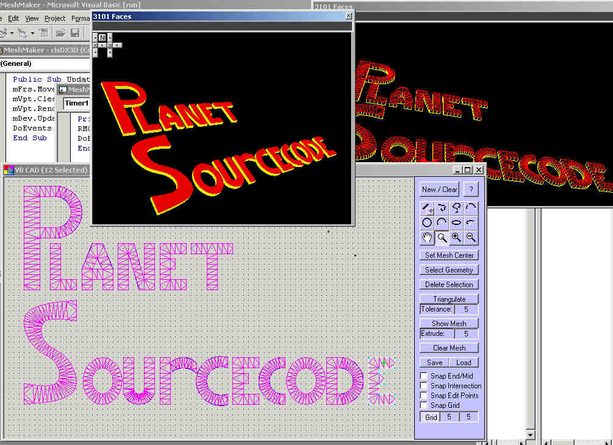



## Delaunay Triangulation Mesh Builder

### Description

Have you even had a complex shape you needed to be turned into a mesh for use in a 3d project? This code shows you how to generate the triangles (DeLaunay Triangulation) based on 'outline' geometry.

 

Implemented in this project is the ability to draw geometry and generate a mesh and a 3D extrusion of the mesh. Supports 'holes' in the mesh as well (auto calculated right-hand,left hand). This method is used for triangulating non-uniform meshes.

 

Included (but NOT fully implemented in THIS project) is a VB-CAD library I designed for a company that makes 3d models from 2D Autocad drawings. This powerful library has all of the math functions to calculate intersection points between all geometry (line,arc,ellipse,spline) It also has an updated DXF import as well as funtions for scaling, flipping, rotating, non-linear arrays, trimming, cornering, relimiting chamfering and rounding.

 

Requires DX7 library for 3d views.
 
### More Info
 

             |
---                |---
**Submitted On**   |2002-06-14 16:10:14
**By**             |[Dave Andrews](https://github.com/Planet-Source-Code/PSCIndex/blob/master/ByAuthor/dave-andrews.md)
**Level**          |Advanced
**User Rating**    |4.8 (222 globes from 46 users)
**Compatibility**  |VB 5\.0, VB 6\.0
**Category**       |[Graphics](https://github.com/Planet-Source-Code/PSCIndex/blob/master/ByCategory/graphics__1-46.md)
**World**          |[Visual Basic](https://github.com/Planet-Source-Code/PSCIndex/blob/master/ByWorld/visual-basic.md)
**Archive File**   |[Delaunay\_T945726142002\.zip](https://github.com/Planet-Source-Code/dave-andrews-delaunay-triangulation-mesh-builder__1-35722/archive/master.zip)

